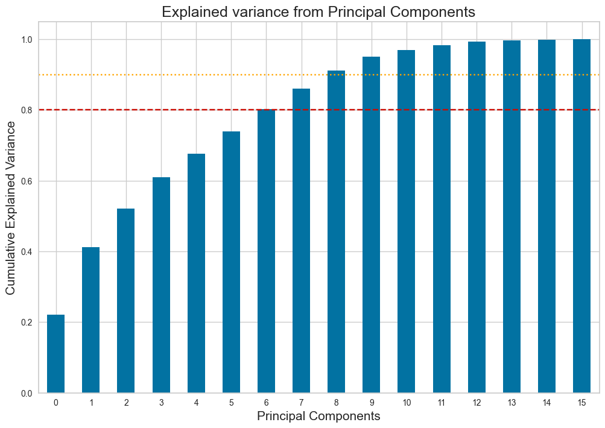
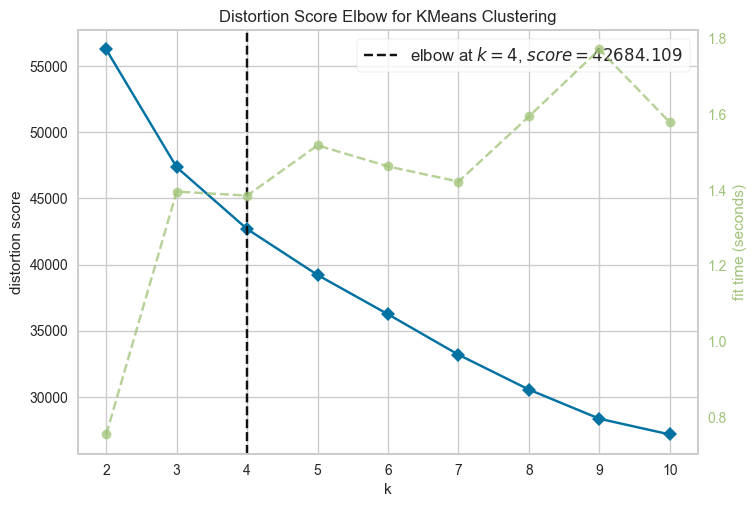
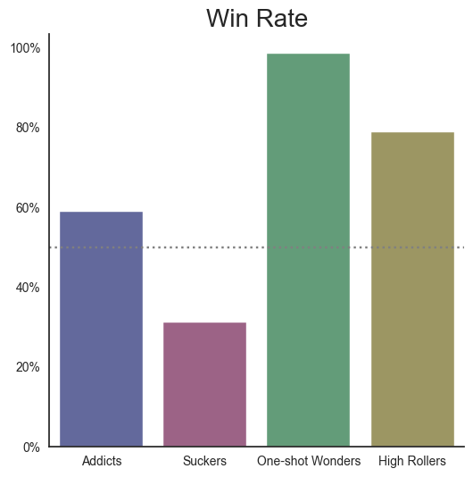
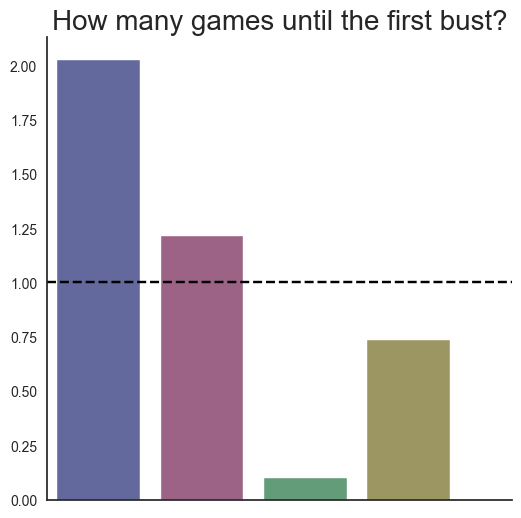
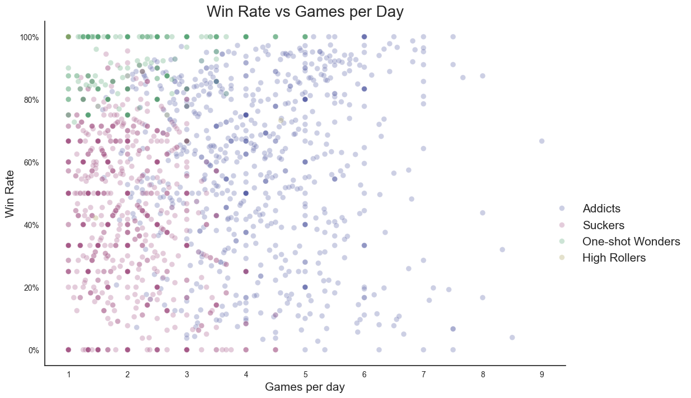

# Categorisation of gambling styles using Machine Learning

This project uses machine learning, specifically K-means clustering, to identify betting patterns and categorise players by playing style in the online game Bustabit.

## Contents
1. [Data](#data)
2. [Feature Engineering](#feature-engineering)
3. [Data Cleaning & Preprocessing](#data-cleaning--preprocessing)
4. [Principal Component Analysis](#principal-component-analysis)
5. [Clustering Analysis](#clustering-analysis)
6. [Dependencies](#dependencies)

## Data
- **The game**: [Bustabit](https://bustabit.com/) is a Bitcoin crash game launched in 2014. Players choose how much to wager before each game starts, then watch a multiplier increase and attempt to cash out at the highest multiplier before the game randomly busts. The player wins their stake multiplied by the multiplier at the point they cashed out; if the game busts before they cash out, they lose their stake.
- The dataset was sourced from [Kaggle](https://www.kaggle.com/datasets/kingabzpro/gambling-behavior-bustabit) and covers games between October and December 2016 – in total, just over 42,000 unique games and 4,000 players are included.
- Each row in the dataset represents one player’s result in a single game; consequently, a game with multiple players is represented by multiple rows. Data include the amount wagered, cash-out multiplier, profit and the eventual bust multiplier for the game.

## Feature Engineering
- Since the data simply represent one player’s outcome in one game, the data were manipulated to engineer a range of numeric features per player, which could be used as inputs for machine learning models to discern patterns.
- These features included totals and averages for games and sessions played, wins, bet size, as well as number of games played before and after the first bust per day, and average cash-out and bust multipliers.

## Data Cleaning & Preprocessing
- Data cleaning: null values are an inherent feature of the data, as some players never lost and others never won, and were imputed as zero to capture this information.
- The data were scaled using the sklearn StandardScaler to account for unit scale differences between features. 

## Principal Component Analysis
- Principal Component Analysis was performed to see if the features could be condensed into categories with minimal loss of information, with the benefit of reducing multicollinearity.
- Ultimately too many components were required to ensure limited information loss (i.e. an explained variance ratio >0.9), and so the analysis was performed without decomposition.

 
## Clustering Analysis
- **4 clusters**: evaluation of the sum-of-squared-errors (plotting an elbow curve) suggested the dataset of players could best be summarised by 4 categories.

- Using simple visualisations to compare the clusters across different metrics provided clear insights into the distinct player types (see [presentation](bustabit_clustering_analysis_presentation.pdf)):
	- Addicts
	- Suckers
	- One-shot wonders
	- High-rollers

 

- In contrast, identifying clear patterns without the use of clusters would be much more difficult, even between key features:

## Dependencies
- Python 3.x
- Sklearn
	- Data preprocessing
	- PCA
	- K-means clustering
- Pandas
- Numpy
- datetime
- Matplotlib & seaborn
